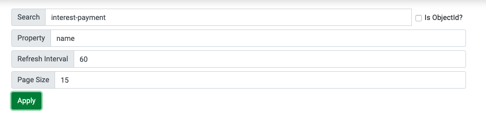

# Agendash 2

A modern, secure, and reliable dashboard for [Agenda](https://github.com/agenda/agenda) with search and pagination capabilities written in vue.js

---

### Features

- Job status auto-refreshes (60-second polling by default)
- Schedule a new job from the UI
- Dive in to see more details about the job, like the json data
- Requeue a job (clone the data and run immediately)
- Delete jobs (Useful for cleaning up old completed jobs)
- Search jobs by name and metadata (supports for quering mongo Object Id)
- Pagination (Original version had limitiation to 200 results only)


---

### Screenshots


---


---



---

# Motivation

At [Software On The Road](softwareontheroad.com/about) we've been using agenda and agendash for almost every project since 2017 but it always had its limitation.
And due to a critical security issue that we found on the server middleware, we decided to fork agendash and rewrote it from scratch.
At first, we tried to just patch the existing code but it was written in backbone.js, so it would be more effort to learn it that just use vue.js to re-create the existing features. After all, this is just a simple CRUD with pagination and search, nothing fancy.


# Roadmap
- [] Improve default security
- [] Compatibility with agenda v3
- [] Polish backend so it is more efficient
- [] Get more test coverage
- [] Add middlewares for KOA and other express-like libraries
- [] You decide!

### Install

```
npm install --save agendash2
```

*Note*: `Agendash` requires mongodb version >2.6.0 to perform the needed aggregate queries. This is your mongo database version, not your node package version! To check your database version, connect to mongo and run `db.version()`.


### Middleware usage

Agendash provides Express middleware you can use at a specified path, for example this will
make Agendash available on your site at the `/dash` path. Note: Do not try to mount Agendash
at the root level like `app.use('/', Agendash(agenda))`.

```js
var express = require('express');
var app = express();

// ... your other express middleware like body-parser

var Agenda = require('agenda');
var Agendash = require('agendash');

var agenda = new Agenda({db: {address: 'mongodb://127.0.0.1/agendaDb'}});
// or provide your own mongo client:
// var agenda = new Agenda({mongo: myMongoClient})

app.use('/dash', Agendash(agenda));

// ... your other routes

// ... start your server
```

By mounting Agendash as middleware on a specific path, you may provide your
own authentication for that path. For example if you have an authenticated
session using passport, you can protect the dashboard path like this:

```
app.use('/dash',
  function (req, res, next) {
    if (!req.user || !req.user.is_admin) {
      res.send(401);
    } else {
      next();
    }
  },
  Agendash(agenda)
);
```

Other middlewares will come soon in the folder `/lib/middlewares/`.
You'll just have to update the last line to require the middleware you need:

```js
app.use('/agendash', Agendash(agenda, {
  middleware: 'koa'
}));
```

Note that if you use a CSRF protection middleware like [`csurf`](https://www.npmjs.com/package/csurf), you might need to [configure it off](https://github.com/agenda/agendash/issues/23#issuecomment-270917949) for Agendash-routes.


### Standalone usage

Agendash comes with a standalone Express app which you can use like this:

```bash
./node_modules/.bin/agendash --db=mongodb://localhost/agendaDb --collection=agendaCollection --port=3001
```

or like this, for default collection `agendaJobs` and default port `3000`:

```bash
./node_modules/.bin/agendash --db=mongodb://localhost/agendaDb
```

If you are using npm >= 5.2, then you can use [npx](https://medium.com/@maybekatz/introducing-npx-an-npm-package-runner-55f7d4bd282b):

```bash
npx agendash --db=mongodb://localhost/agendaDb --collection=agendaCollection --port=3001
```
