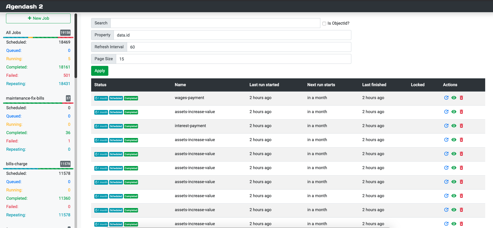
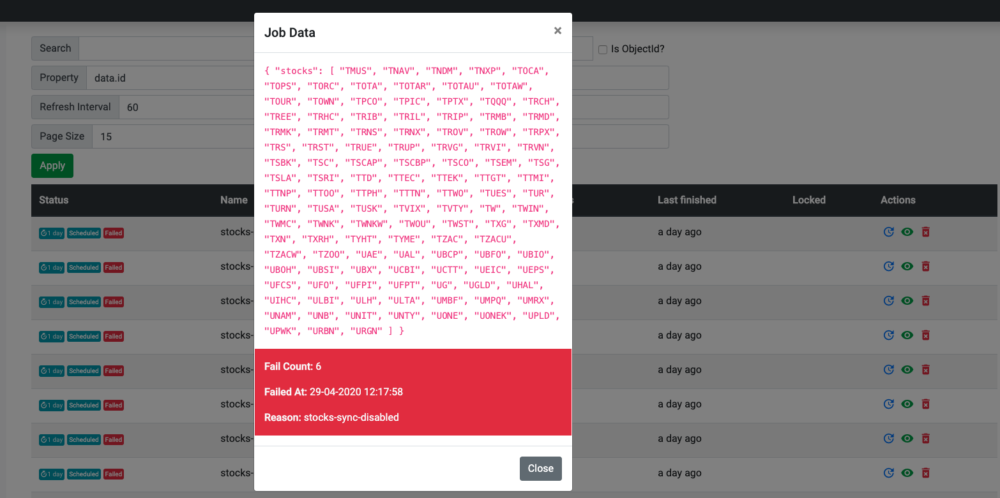

# Agendash
[](https://travis-ci.org/joeframbach/agendash)

A Dashboard for [Agenda](https://github.com/rschmukler/agenda)

---

### Features

- Job status auto-refreshes (2-second polling by default)
- Schedule a new job from the UI
- Dive in to see more details about the job, like the json data
- Requeue a job (clone the data and run immediately)
- Delete jobs (Useful for cleaning up old completed jobs)

### Notes

 - Automatically creates additional indexes on several columns (See #24).

---

### Screenshots



---



---

### Install

```
npm install --save agendash
```

*Note*: `Agendash` requires mongodb version >2.6.0 to perform the needed aggregate queries. This is your mongo database version, not your node package version! To check your database version, connect to mongo and run `db.version()`.

### Standalone usage

Agendash comes with a standalone Express app which you can use like this:

```bash
./node_modules/.bin/agendash --db=mongodb://localhost/agendaDb --collection=agendaCollection --port=3001
```

or like this, for default collection `agendaJobs` and default port `3000`:

```bash
./node_modules/.bin/agendash --db=mongodb://localhost/agendaDb
```

### Middleware usage

Agendash provides Express middleware you can use at a specified path, for example this will 

```js
var express = require('express');
var app = express();

// ... your other express middleware like body-parser

var Agenda = require('agenda');
var Agendash = require('agendash');

var agenda = new Agenda({mongo: 'mongodb://127.0.0.1/agendaDb'});
app.use('/agendash', Agendash(agenda));

// ... your other routes

// ... start your server
```

Other middlewares will come soon in the folder `/lib/middlewares/`.
You'll just have to update the last line to require the middleware you need: 

```js
app.use('/agendash', Agendash(agenda, {
  middleware: 'koa'
}));
```

### Additional options

The second argument to Agendash is an optional object. Valid keys are:

- `middleware`: Currently only `'express'` is supported. I'd like to use `'koa'` soon.
- `title`: Defaults to `"Agendash"`. Useful if you are running multiple Agenda pools.

### Help appreciated

There are several things I would like help with:

-  [ ] I'm rusty with Backbone. Clean up the client code. I wasn't sure on the best way to trigger and handle update events.
-  [ ] Write some tests!
-  [ ] Use Agendash and submit issues!
